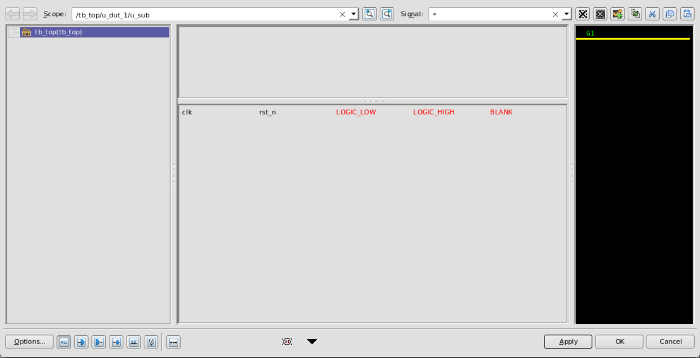
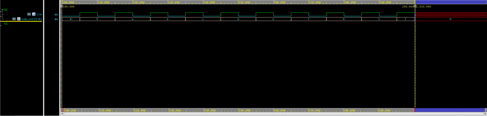
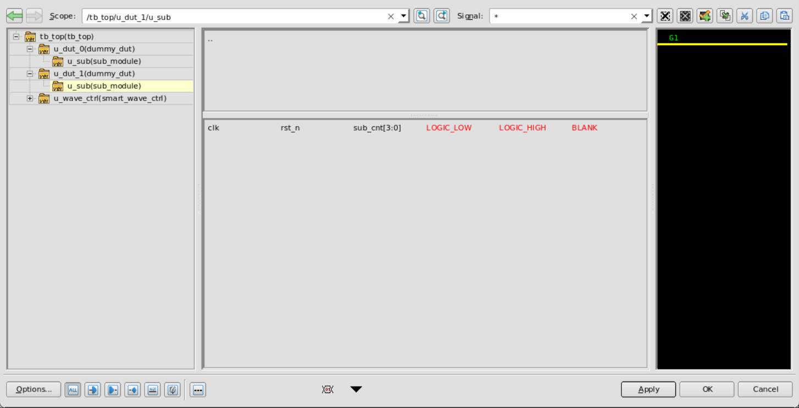
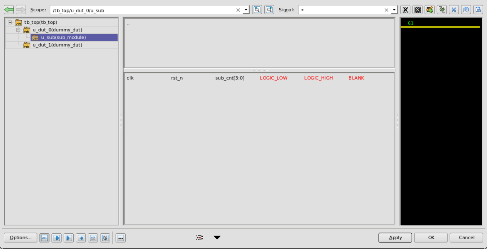

# SV Smart Wave (中文版)

[English Version](README.md)

一个轻量级、即插即用的 SystemVerilog 模块，通过 Makefile 封装实现更优雅的波形 Dump 控制。

## 主要特性
- **极简命令行体验**: 通过简单的 `make` 参数控制复杂的波形导处逻辑。
- **精准时间窗口**: 使用 `START` 和 `END` 参数指定抓取波形的仿真时间段。
- **性能与体积平衡**: 通过 `DEPTH` 控制抓取层级，彻底告别动辄 100GB 的 FSDB 文件。
- **零额外开销**: 基于标准的 SystemVerilog `plusargs` 实现，无需任何 PLI/VPI C 代码。

## 文件结构
- `src/smart_wave_ctrl.sv`: 核心波形控制模块。
- `tb/`: 测试平台文件，包含顶层模块和演示 DUT。
- `cfg/wave_list.f`: 信号列表配置文件示例。
- `Makefile`: 封装了 VCS 编译与仿真自动化脚本。

## 模块集成
1. 将 `src/smart_wave_ctrl.sv` 添加到项目的编译列表中。
2. 在测试平台的顶层模块中实例化 `smart_wave_ctrl`。

```systemverilog
module tb_top;
    // ...
    smart_wave_ctrl u_wave_ctrl();
    // ...
endmodule
```

## 使用说明

### 1. 基础仿真 (默认)
执行基础仿真，默认仅抓取顶层接口信号（深度为 1）。
```bash
make sim
```

> [!NOTE]
> 该命令对应仿真参数：`./simv +fsdb_on +dump_depth=1`。

### 2. 时间窗口控制
通过 Makefile 参数精准控制波形的起始和结束时间。
```bash
make sim START=100 END=200
```

> [!TIP]
> 内部会自动将参数换算并传递给仿真器。

### 3. 全层级信号抓取
记录设计中所有的内部信号。**在大规模设计中请慎用**，防止磁盘耗尽。
```bash
make sim_all
```

> [!NOTE]
> 该命令使用 `+dump_view=all +dump_depth=0`。

### 4. 信号列表抓取
使用外部配置文件 `cfg/wave_list.f` 定义复杂的 Dump 范围。
```bash
make sim_list
```

> [!NOTE]
> 该命令使用 `+dump_view=list +dump_list=cfg/wave_list.f`。

## 快速命令参考
```bash
make compile      # VCS 编译
make sim          # 运行默认仿真 (深度 1)
make sim_all      # 运行全量 Dump 仿真
make verdi        # 使用 Verdi 查看波形
```

## 许可证
MIT 或 Apache-2.0
